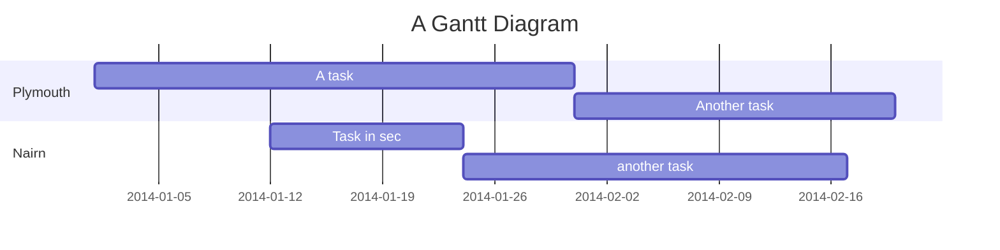

# Mermaid test

This is my first paragraph.

```mermaid
  graph TD;
      A-->B;
      A-->C;
      B-->D;
      C-->D;
```

Another one:

```mermaid
  gantt
    title A Gantt Diagram
    dateFormat  YYYY
    section Plymouth
    A task           :a1, 2014-01-01, 30d
    Another task     :after a1  , 20d
    section Nairn
    Task in sec      :2014-01-12  , 12d
    another task      : 24d
```

