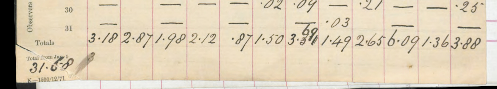
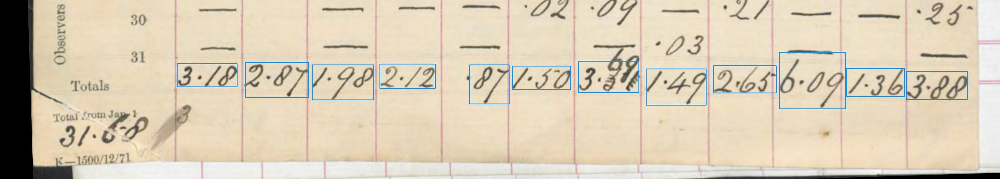

## Daily Rainfall Sheet Processing

Image file: **DR_Anglesey_1871-1880C_p020.rot.jpg** : [link](../rotated/DR_Anglesey_1871-1880C_p020.rot.jpg) Image shape: 5426 rows x 3452 columns

TYRain sheet match: *[Not matched]* 
Concatenation file match: *[Not matched]*

### Textract Response

489 'Word Blocks' in the Textract response.
### Totals Extraction

&nbsp; 

12 potential monthly totals extracted
|Raw text|Confidence|For matching|Notes|
|-------:|---------:|------------:|:----|
|3.18|100|3.18||
|2.87|99|2.87||
|1.98|100|1.98||
|2.12|100|2.12||
|87|85|**.87**|Adjusted: Inferred decimal point restored|
|1.50|99|1.50||
|**3.3%**|50||Not recognised|
|1.49|100|1.49||
|2.65|99|2.65||
|6.09|99|6.09||
|1.36|97|1.36||
|3.88|99|3.88||
