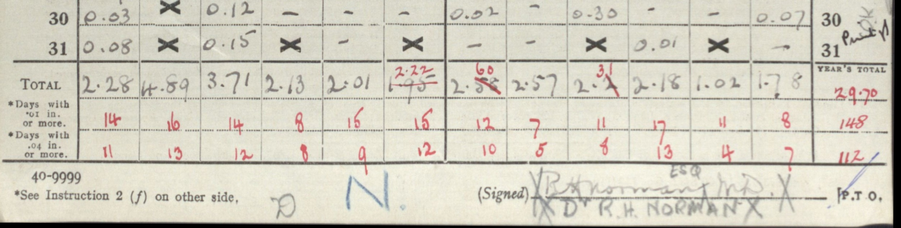
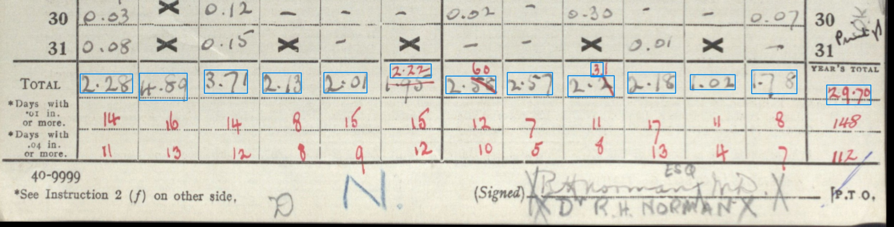

## Daily Rainfall Sheet Processing

Image file: **Seaton1933.rot.jpg** : [link](../rotated/Seaton1933.rot.jpg) Image shape: 4302 rows x 2491 columns

TYRain sheet match: **TYRain_1931-1940_11_pt1/p170** year **1933** 
Concatenation file match: *[Not matched]*

### Textract Response

539 'Word Blocks' in the Textract response.
### Totals Extraction

&nbsp; 

14 potential monthly totals extracted
|Raw text|Confidence|For matching|Notes|
|-------:|---------:|------------:|:----|
|2.28|100|2.28||
|4.89|88|4.89||
|3.71|100|3.71||
|2.63|63|2.63||
|2.01|74|2.01||
|2.22|87|2.22||
|2.58|39|2.58||
|2.57|99|2.57||
|**2.4**|67|-|Not recognised|
|**3.**|80|-|Not recognised|
|2.18|95|2.18||
|1.02|88|1.02||
|**178**|58|1.78|Adjusted: Inferred decimal point restored|
|29.70|98|29.70||

### Matching to a TYRain sheet + year

Most monthly matches : 9 matches (1 case) 
Next best : 3 matches (129 cases) 

Clear best TYRain sheet match found: **TYRain_1931-1940_11_pt1/p170** year **1933** 
 

<detailsx>

Details of the best TYRain sheet match

|   |Month|Value|Match?||Raw extract|Conf|Adj extract|Notes|
|--:|:----|----:|:-----|:-----|--------:|----:|---------:|:----|
|1|January|2.28|Yes|&#x22EE;|2.28|100|2.28||
|2|February|4.89|Yes|&#x22EE;|4.89|88|4.89||
|3|March|3.71|Yes|&#x22EE;||3.71|100|3.71||
|4|April|2.13|**No**|&#x22EE;|||||
||||**No**|&#x22EE;|2.63|63|2.63||
|5|May|2.01|Yes|&#x22EE;|2.01|74|2.01||
|6|June|2.22|Yes|&#x22EE;|2.22|87|2.22||
|7|July|2.6|**No**|&#x22EE;|||||
||||**No**|&#x22EE;|2.58|39|2.58||
|8|August|2.57|Yes|&#x22EE;|2.57|99|2.57||
|9|September|2.31|**No**|&#x22EE;|||||
||||**No**|&#x22EE;|2.4|67|-|Not recognised as a monthly total|
||||**No**|&#x22EE;|3.|80|-|Not recognised as a monthly total|
|10|October|2.18|Yes|&#x22EE;|2.18|95|2.18||
|11|November|1.02|Yes|&#x22EE;|1.02|88|1.02||
|12|December|1.78|Yes|&#x22EE;|178|58|1.78|Adjusted: Inferred decimal point restored|
||||**No**|&#x22EE;|29.70|98|29.70||

Matched 9 out of 12 monthly totals

### Matching to a Concatenation file + year

Most monthly matches : 3 matches (123 cases) 
Next best : 2 matches (5619 cases) 

**No clear Concatenation file match found** 
Best Concatenation file matches found:
* ALCESTER-THE-PLECK.csv year 1955
* ALVECHURCH-UPLANDS.csv year 1893
* ALVECHURCH-UPLANDS.csv year 1899
* APPLETON-RES-2.csv year 1955
* ARUNDEL-CASTLE.csv year 1936
* .. and more ..
 

Details of an example Concatenation file match

|   |Month|Value|Match?|Raw match|Conf.|Adj. match|Notes|
|--:|:----|----:|:-----|--------:|----:|---------:|:----|
|1|January|2.65|**No**|||||
||||**No**|2.28|100|2.28||
|2|February|1.59|**No**|||||
||||**No**|4.89|88|4.89||
|3|March|2.11|**No**|||||
||||**No**|3.71|100|3.71||
|4|April|1.13|**No**|||||
|5|May|4.37|**No**|||||
|6|June|2.63|Yes|2.63|63|2.63||
|7|July|0.46|**No**|||||
||||**No**|2.01|74|2.01||
|8|August|0.33|**No**|||||
|9|September|1.09|**No**|||||
|10|October|1.33|**No**|||||
|11|November|2.22|Yes|2.22|87|2.22||
||||**No**|2.58|39|2.58||
||||**No**|2.57|99|2.57||
||||**No**|2.4|67|-|Not recognised as a monthly total|
||||**No**|3.|80|-|Not recognised as a monthly total|
|12|December|2.18|Yes|2.18|95|2.18||
||||**No**|1.02|88|1.02||
||||**No**|178|58|1.78|Adjusted: Inferred decimal point restored|
||||**No**|29.70|98|29.70||

Matched 3 out of 12 monthly totals

